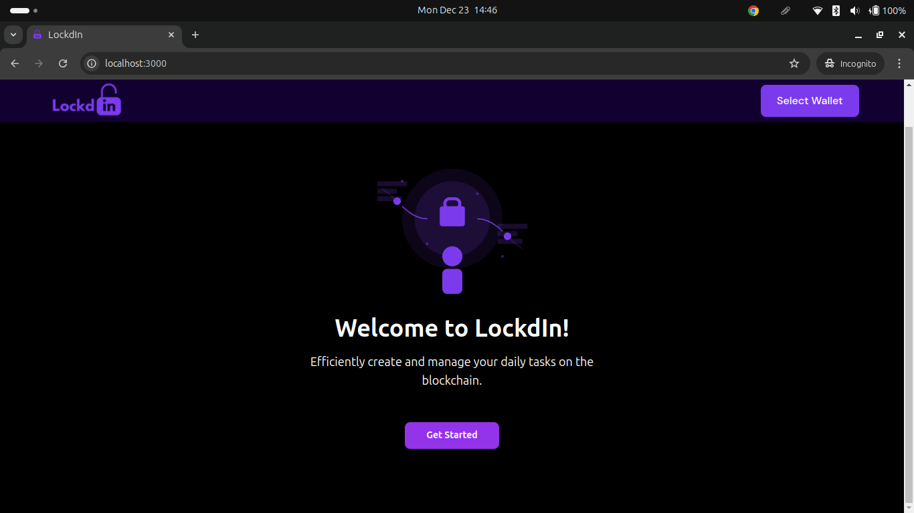

# LockdIn

LockdIn is a decentralized todo list application built on the Solana blockchain. It allows users to create, manage, and track tasks with features like task assignment, priority levels, and completion streaks.


## Features

- Create and manage tasks with titles and descriptions
- Set task priorities (Leisure, Casual, Urgent)
- Categorize tasks (Work, Personal, Home, Shopping)
- Assign tasks to other users
- Track task status (Pending, InProgress, Completed, Cancelled)
- Maintain completion streaks for consistent task completion
- Task limits and validation to ensure data integrity


## Smart Contract Structure

The program consists of several key components:

### State
- `Task`: Represents a single todo item with properties like title, description, priority, status, etc.
- `UserTodoList`: Stores a user's tasks and completion streak information

### Instructions
1. `create_todo_task`: Create a new task with title, description, priority, and optional assignee
2. `update_task_status`: Update a task's status (e.g., mark as completed)
3. `reassign_task`: Assign a task to a different user

## Technical Details

### Task Constraints
- Maximum title length: 50 characters
- Maximum description length: 250 characters
- Maximum tasks per user: 100

### Task Properties
- ID
- Title
- Description
- Creator
- Assignee (optional)
- Priority
- Status
- Category
- Creation timestamp
- Last update timestamp
- Completion timestamp (if completed)

### Error Handling
The program includes comprehensive error handling for cases such as:
- Invalid title/description length
- Unauthorized modifications
- Invalid status transitions
- Task limit exceeded
- Task not found

## Development

### Prerequisites
- Solana Tool Suite
- Anchor Framework
- Node.js and npm/yarn

### Building
```bash
anchor build
```

### Testing
```bash
anchor test
```

### Program ID (subject to change)
```
6rmb4Kmxibx3DVj9TDZ8tq5JrQhRGhEnyEtVrb7b8UUn
```

## Security Features

- Task modifications restricted to creator or assignee
- PDA-based account management
- Status transition validation
- Task limit enforcement

## Contributing

Feel free to submit issues and pull requests for:
- New features
- Bug fixes
- Documentation improvements
- Test coverage improvements